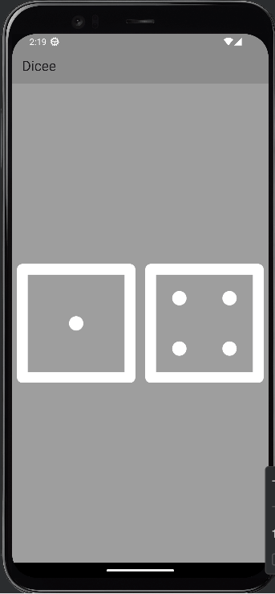

# dicee_flutter 🎲

A fun and interactive dice rolling app built using Flutter! This project is part of the "Complete Flutter Development Bootcamp with Dart" Udemy course. The app allows users to roll two dice with the press of a button, generating random dice values.

## Features

- 🎲 Roll two dice by tapping a button.
- 🎨 Simple, clean, and engaging user interface.
- 🔀 Generates random dice values on each roll.

## Demo Video

## How it Works
The app generates two random numbers between 1 and 6 using Dart’s Random() class, simulating the roll of two dice. The dice images on the screen are updated based on these random numbers.

## Project Structure
- lib/: Contains the main code for the app.
- main.dart: The entry point of the app.

## Technologies Used
- Flutter: UI toolkit for building natively compiled mobile apps.
- Dart: Programming language used in Flutter.
- Android Studio: IDE used for development.

  ## 📚 Resources
- **Flutter Documentation**: [flutter.dev](https://flutter.dev)
- **Dart Language**: [dart.dev](https://dart.dev)
- **Course Reference**: *The Complete Flutter Development Bootcamp with Dart* by Angela Yu  
